# The Task

*Fulfill your goals, one task at a time*

## Description

A simple to-do app where you're only allowed one task at a time, and that task is defined for you. You define your goals and let generative AI help by breaking those down into small incremental tasks to help you succeed. To help with focus, only one task is active at a time.

## Features

- **Goal-Driven Task Management**: Define your long-term goals, and let the app guide you with AI-generated tasks.
- **Single-Task Focus**: Stay productive by concentrating on just one task at a time.
- **Generative AI Integration**: Experience how AI can be more than just a chatbot by generating structured, meaningful tasks aligned with your goals.

## Purpose

This app explores the integration of generative AI into a practical application. It aims to demonstrate how AI can be used to generate content in a structured format, offering more than just conversational capabilities. **The Task** is a step towards exploring the potential of AI in everyday productivity tools.

## Instructions

This app is created with Flutter and Stacked CLI.

* [Install Flutter](https://docs.flutter.dev/get-started/install) (required)
* [Install Stacked CLI](https://stacked.filledstacks.com/docs/tooling/stacked-cli/) (optional)

To run, you need to specify the Gemini API key to use by setting it with [dart define](https://dartcode.org/docs/using-dart-define-in-flutter/). You can acquire an API key [here](https://aistudio.google.com/app/apikey).

``--dart-define=GEMINI_API_KEY=...``

## Screenshots

|                        |                        |                        |
|------------------------------|------------------------------|------------------------------|
| 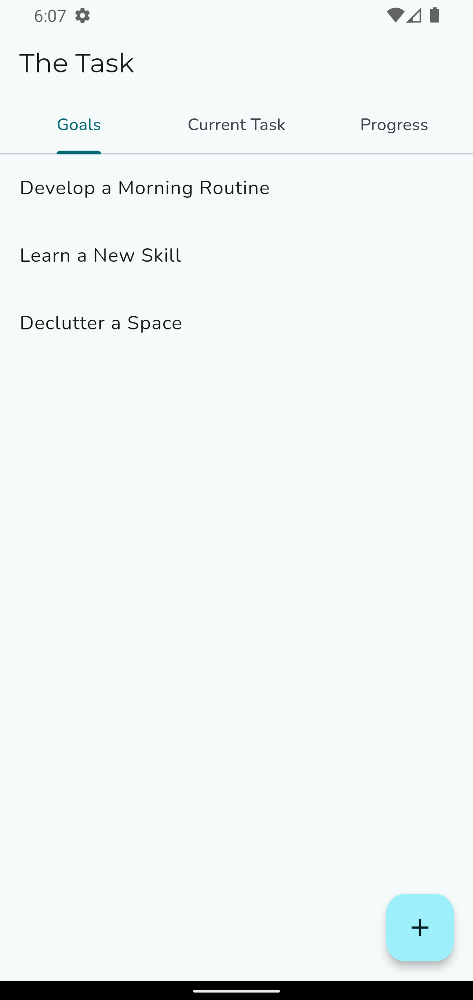 | 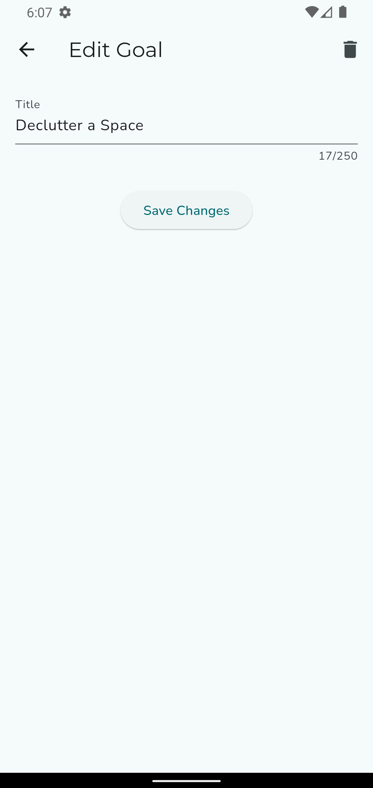 | 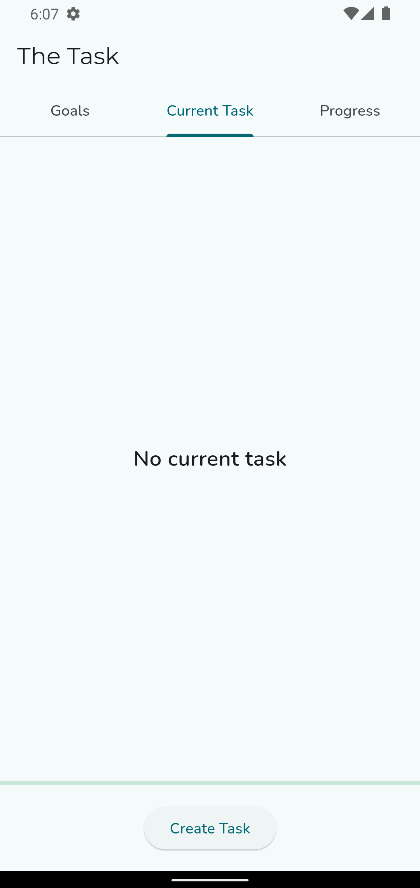 |
| 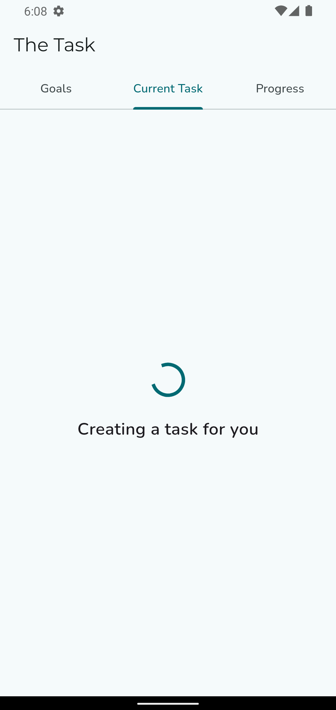 | 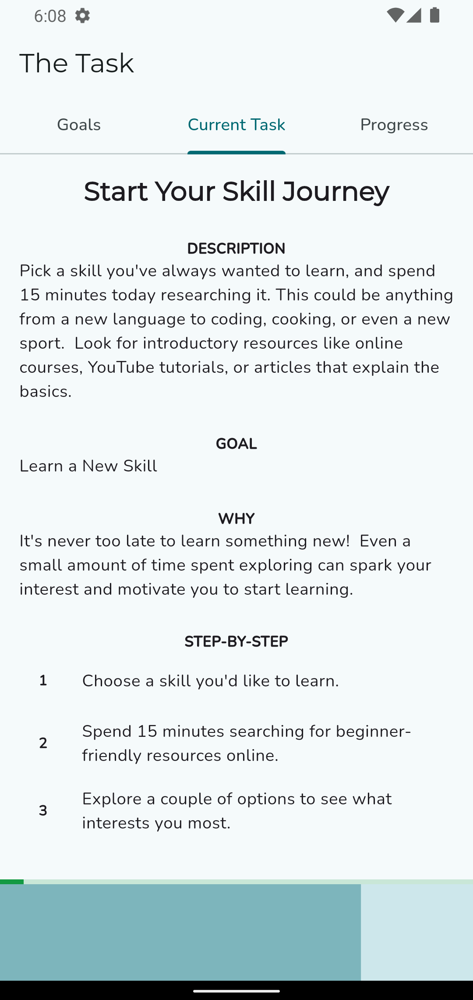 | 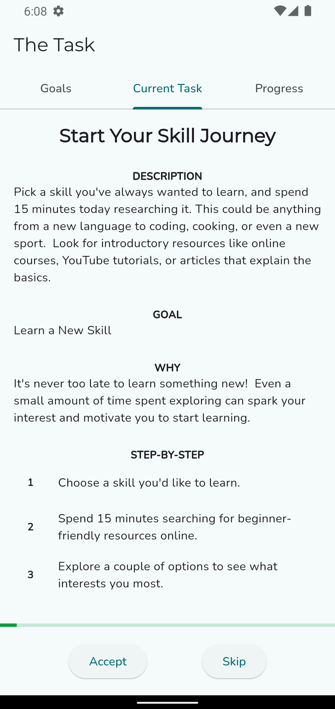 |
| 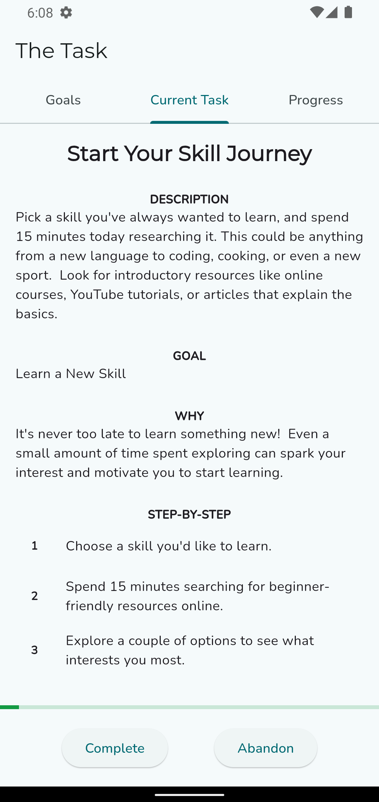 | 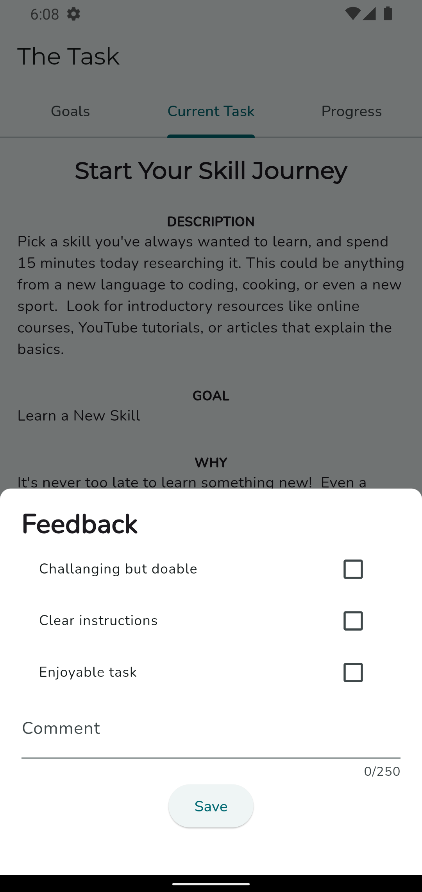 | 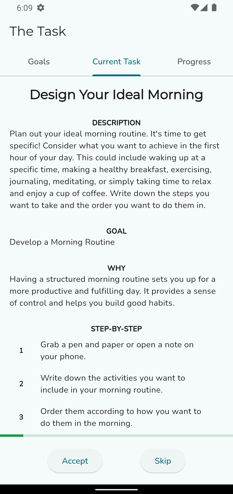 |
| 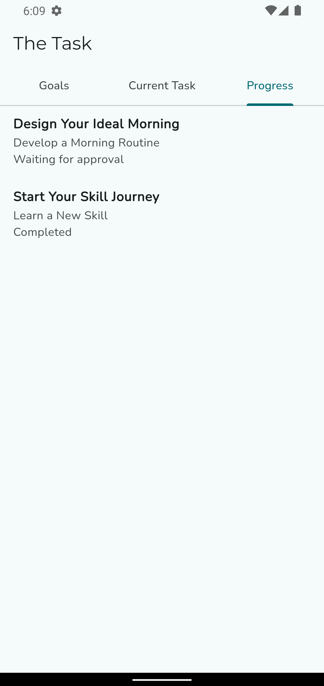 | 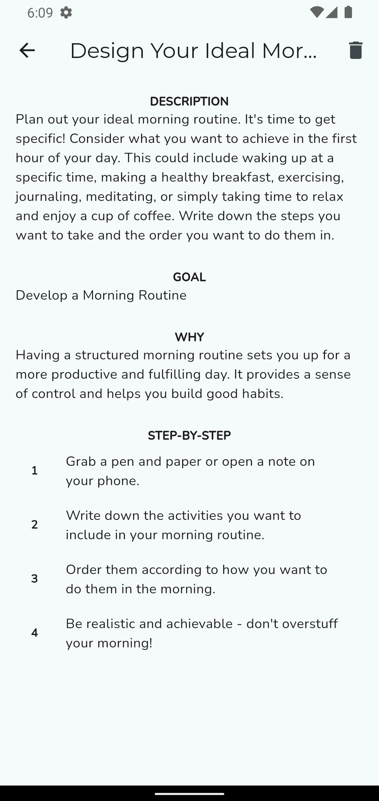 | |
